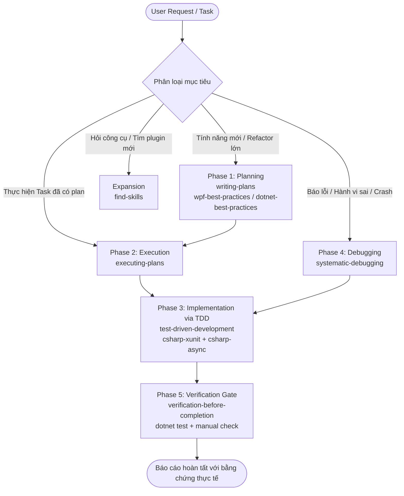

# NeatShot Workflow Orchestrator (Master Tech Lead)

## Overview & Role

The **Workflow Orchestrator** functions as the project's **Virtual Tech Lead**. Its primary objective is to free the developer from having to remember specific slash commands or manual skill configurations.

Whenever an instruction, feature request, or bug report is received, this orchestrator:
1. **Detects Intent & Scope**: Identifies whether the request is planning, execution, debugging, refactoring, UI/XAML, or system-level.
2. **Selects & Activates Skills**: Automatically pulls in the relevant skills from the workspace toolkit.
3. **Enforces Sequential Quality Gates**: Guarantees that steps happen in the correct order (e.g. Planning → TDD → Verification).
4. **Applies NeatShot Architecture Guardrails**: Enforces Win32, WPF, DPI awareness, and MVVM standards.

---

## The Master Skill Chaining Matrix

Every engineering task in NeatShot falls into one or more workflow phases. Skills must be chained in strict chronological order:

---

## Phase Breakdown & Skill Activation Rules

### Phase 1: Planning & Specification
- **When**: New feature, architectural changes, complex refactoring (> 2 files or multi-step logic).
- **Primary Skill**: `writing-plans`
- **Domain Skills to Consult**:
  - `wpf-best-practices` if the feature involves XAML, custom controls, Canvas overlays, adorners, or MVVM data binding.
  - `dotnet-best-practices` if designing dependency injection, service interfaces, or clean class boundaries.
  - `dotnet-pinvoke` if integrating native Windows APIs, global mouse/keyboard hooks, or GDI/DirectX screen capture.
- **Output Artifact**: A structured plan in `docs/superpowers/plans/<date>-<task-name>.md` with clear task breakdown, TDD acceptance criteria, and verification commands.

### Phase 2: Plan Execution
- **When**: Starting to implement an approved plan or executing tasks in sequence.
- **Primary Skill**: `executing-plans`
- **Workflow**:
  - Read current plan and track progress in `progress.md`.
  - Process one task at a time.
  - Never mark a task complete without executing Phase 3 and Phase 5.

### Phase 3: Implementation via TDD (The Iron Law)
- **When**: Writing any production code (business logic, geometry calculations, helpers, viewmodels).
- **Primary Skill**: `test-driven-development`
- **Supporting Technical Skills**:
  - `csharp-xunit`: Writing idiomatic xUnit tests with `[Fact]`, `[Theory]`, `[InlineData]`, and clean assertions (`Should().Be(...)` or `Assert.*`).
  - `csharp-async`: Proper handling of `async`/`await`, `TaskCompletionSource`, `CancellationToken`, avoiding `.Result` or `.Wait()` deadlocks.
  - `wpf-best-practices`: Adhering to WPF threading rules (UI on STA thread, background tasks off-thread, `Dispatcher.InvokeAsync` when marshaling).
- **The Red-Green-Refactor Cycle**:
  1. **RED**: Write a failing unit test in `tests/NeatShot.Tests/`.
  2. **VERIFY RED**: Run `dotnet test` to confirm it fails for the expected reason.
  3. **GREEN**: Write minimal production code in `src/NeatShot/` to make the test pass.
  4. **REFACTOR**: Clean up code, remove duplication, and preserve readability.

### Phase 4: Systematic Debugging
- **When**: User reports an issue, a test fails unexpectedly, UI clipping occurs, or app crashes.
- **Primary Skill**: `systematic-debugging`
- **Strict Protocol**:
  1. **Reproduce & Isolate**: Confirm exact input, screen resolution, DPI scale, or window geometry.
  2. **Root Cause Analysis**: Trace back to origin (do NOT guess or apply random trial-and-error fixes).
  3. **Form Hypothesis & Minimal Test**: Write a failing test or diagnostic log verifying the root cause.
  4. **Targeted Fix**: Address the root cause directly without introducing breaking changes elsewhere.
  5. **Regression Verification**: Confirm all existing tests still pass.

### Phase 5: Verification Gate (Evidence Before Assertions)
- **When**: Before claiming any task is done, before committing to Git, or before transitioning to the next task.
- **Primary Skill**: `verification-before-completion`
- **Mandatory Requirements**:
  - Run the full test suite: `dotnet test tests/NeatShot.Tests/NeatShot.Tests.csproj`.
  - Confirm test output shows 0 failures (e.g. `Passed!  - Failed: 0, Passed: 109, Skipped: 0, Total: 109`).
  - Run build verification: `dotnet build src/NeatShot/NeatShot.csproj`.
  - If UI behavior was modified, verify coordinates, DPI transforms, or manual interaction flow.
  - Provide tangible evidence (test logs, output excerpts) in the final response.

---

## Intelligent Intent Router Table

Use this quick lookup table to match user requests (Vietnamese & English) with the target skill pipeline:

| User Intent / Keywords (VN & EN) | Primary Skill | Supporting Skills | Pipeline Order |
| :--- | :--- | :--- | :--- |
| "Thêm tính năng mới", "Tạo chức năng X", "Thiết kế", "New feature", "Spec" | `writing-plans` | `wpf-best-practices`, `dotnet-best-practices` | Phase 1 → Phase 2 → Phase 3 → Phase 5 |
| "Triển khai task N", "Làm task tiếp theo", "Execute task", "Tiến hành làm" | `executing-plans` | `test-driven-development`, `csharp-xunit` | Phase 2 → Phase 3 → Phase 5 |
| "Bị lỗi", "Bug", "Sao không chạy được", "Lệch khung", "Crash", "Freeze", "Không bấm được" | `systematic-debugging` | `dotnet-pinvoke`, `wpf-best-practices` | Phase 4 → Phase 3 (Regression Test) → Phase 5 |
| "Viết code logic", "Thêm class", "Cài đặt thuật toán", "Refactor hàm này" | `test-driven-development` | `csharp-xunit`, `dotnet-best-practices` | Phase 3 (RED → GREEN → REFACTOR) → Phase 5 |
| "Làm giao diện", "XAML", "Toolbar", "Màu sắc", "Nút bấm", "Canvas", "Adorner" | `wpf-best-practices` | `test-driven-development` | Check WPF patterns → TDD (Helper/VM) → XAML → Verify |
| "Gọi Windows API", "P/Invoke", "Hook chuột/phím", "Chụp toàn màn hình", "Win32" | `dotnet-pinvoke` | `systematic-debugging`, `dotnet-best-practices` | Signature check → SafeHandle → Memory safety → Verify |
| "Xử lý bất đồng bộ", "Async/await", "Lag UI", "Thread freeze", "Task.Run" | `csharp-async` | `wpf-best-practices` | Async best practices → Thread marshalling → Verify |
| "Xong chưa?", "Kiểm tra lại", "Chạy test", "Commit code", "Verify" | `verification-before-completion` | `csharp-xunit` | `dotnet test` → `dotnet build` → Summary |
| "Tìm skill", "Có skill nào cho...", "Cài thêm công cụ", "Extend capabilities" | `find-skills` | - | Search skills ecosystem |

---

## NeatShot Core Engineering Guardrails

When operating in this codebase, the Orchestrator enforces these non-negotiable rules:

1. **Per-Monitor DPI Awareness**:
   - Screen coordinates returned by Win32 APIs (e.g. `GetCursorPos`, `VirtualScreen`) are in **physical device pixels**.
   - WPF Canvas elements and Window measurements operate in **device-independent units (96 DPI)**.
   - Always convert using `VisualTreeHelper` or explicit DPI scale factors (`PointFromScreen`, `PointToScreen`, `DpiScale`).
2. **WPF STA Thread Confinement**:
   - Never update `ObservableCollection`, `UIElement`, or bound properties from a background thread without `Dispatcher.InvokeAsync`.
   - Never block the UI thread with `.Wait()` or `.Result` on a Task.
3. **No Blind Fixes**:
   - When fixing geometry issues (e.g. Toolbar overflowing screen bounds), calculate mathematically using explicit bounding rectangles and unit tests (e.g. `ToolbarPositionHelperTests`).
4. **Clean Commits with Full Passing Tests**:
   - Never push or mark work complete while `dotnet test` has failing tests.

---

## Agent Pre-Response Self-Check

Before delivering the response to the user, run this internal validation:
- [ ] Did I identify the correct workflow phase for this request?
- [ ] Did I activate the necessary domain skills?
- [ ] Did I follow TDD (wrote tests before production code)?
- [ ] Did I run `dotnet test` and obtain real passing output before declaring success?
- [ ] Did I provide file links in github markdown format (`file:///...`)?
