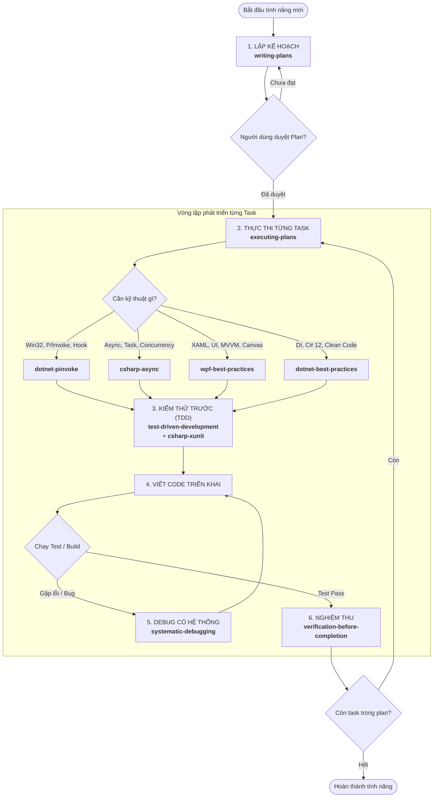

# HƯỚNG DẪN QUY TRÌNH PHÁT TRIỂN VÀ SỬ DỤNG AGENT SKILLS (NEATSHOT)

> **Tài liệu hướng dẫn thực hành (Playbook):** Chuẩn hóa quy trình "Vibe Coding có kỷ luật" cho dự án chụp màn hình **NeatShot / NeatSnap** sử dụng C# (.NET 8/9), WPF và Win32 Interop.

---

## 1. Bản đồ phối hợp các Skills (Workflow Lifecycle)

Mỗi skill đại diện cho một vai trò chuyên môn trong đội ngũ kỹ sư phần mềm. Dưới đây là sơ đồ phối hợp chuẩn từ lúc bắt đầu tính năng đến khi hoàn thành:

---

## 2. Danh mục chi tiết và Cách sử dụng từng Skill

Dự án hiện có **11 skills** được chia thành 2 nhóm chính:
1. **Nhóm Quy trình Kỹ sư phần mềm (Engineering Workflow Skills)**: Quản lý kế hoạch, phương pháp và kỷ luật code.
2. **Nhóm Kỹ thuật Chuyên sâu C#/.NET/WPF (Technical Domain Skills)**: Hướng dẫn viết code chuẩn kỹ thuật, tối ưu hiệu năng.

---

### PHẦN I: NHÓM QUY TRÌNH KỸ SƯ PHẦN MỀM (WORKFLOW)

#### 1. `writing-plans`
* **Vị trí:** [writing-plans/SKILL.md](file:///d:/Tu-hoc/project/NeatShot/.agents/skills/writing-plans/SKILL.md)
* **Mục đích:** Đọc tài liệu yêu cầu (SRS, Architecture) và chia nhỏ thành các task độc lập, tuần tự (Bite-sized tasks), có định nghĩa rõ file cần sửa/tạo và tiêu chí kiểm thử (Acceptance Criteria).
* **Khi nào dùng:** Khi chuẩn bị làm một tính năng mới hoặc một giai đoạn (Phase) từ tài liệu đặc tả, **trước khi viết bất kỳ dòng code nào**.
* **Câu lệnh / Prompt kích hoạt:**
  > *"Kích hoạt skill writing-plans: Đọc [SRS-screenshot-app.md](file:///d:/Tu-hoc/project/NeatShot/SRS-screenshot-app.md) và [TECH-STACK-AND-ARCHITECTURE.md](file:///d:/Tu-hoc/project/NeatShot/TECH-STACK-AND-ARCHITECTURE.md), hãy lập kế hoạch chi tiết cho Phase 1 MVP."*
  > Hoặc gõ lệnh `/plan`.

---

#### 2. `executing-plans`
* **Vị trí:** [executing-plans/SKILL.md](file:///d:/Tu-hoc/project/NeatShot/.agents/skills/executing-plans/SKILL.md)
* **Mục đích:** Dẫn dắt AI thực thi nghiêm ngặt kế hoạch đã lập. Đi từng task một, cập nhật trạng thái checklist, không nhảy cóc hay sửa lan man ngoài phạm vi.
* **Khi nào dùng:** Ngay sau khi plan đã được duyệt và bạn muốn bắt đầu code.
* **Câu lệnh / Prompt kích hoạt:**
  > *"Sử dụng skill executing-plans để triển khai Task 1 trong file plan vừa tạo."*

---

#### 3. `test-driven-development` (TDD)
* **Vị trí:** [test-driven-development/SKILL.md](file:///d:/Tu-hoc/project/NeatShot/.agents/skills/test-driven-development/SKILL.md)
* **Mục đích:** Quy trình Red → Green → Refactor. Bắt buộc viết unit test kiểm tra logic trước khi triển khai code chính.
* **Khi nào dùng:** Khi làm các module tính toán logic thuần tuý: `DpiHelper` (tính scale 100%, 125%, 150%), `ColorHelper` (HEX/RGB conversion), thuật toán giao cắt vùng chọn, cơ chế Undo Stack.
* **Câu lệnh / Prompt kích hoạt:**
  > *"Sử dụng skill test-driven-development: Viết xUnit test trước cho module DpiHelper tính toạ độ Virtual Screen khi có đa màn hình."*

---

#### 4. `systematic-debugging`
* **Vị trí:** [systematic-debugging/SKILL.md](file:///d:/Tu-hoc/project/NeatShot/.agents/skills/systematic-debugging/SKILL.md)
* **Mục đích:** **Tuyệt đối cấm sửa mò (trial-and-error).** Khi có bug hoặc test fail, AI phải:
  1. Tái hiện lỗi (Reproduce).
  2. Xác định nguyên nhân gốc rễ (Root Cause) với chứng cứ.
  3. Viết test case chứng minh lỗi.
  4. Sửa code tối thiểu để pass test.
* **Khi nào dùng:** Khi gặp bất kỳ runtime exception, crash app, lệnh chụp bị đen màn hình, hoặc test xUnit thất bại.
* **Câu lệnh / Prompt kích hoạt:**
  > *"Ứng dụng đang bị lỗi [mô tả lỗi]. Hãy dùng skill systematic-debugging để phân tích root cause và sửa lỗi triệt để, không sửa mò."*

---

#### 5. `verification-before-completion`
* **Vị trí:** [verification-before-completion/SKILL.md](file:///d:/Tu-hoc/project/NeatShot/.agents/skills/verification-before-completion/SKILL.md)
* **Mục đích:** Ép AI chạy lệnh kiểm tra thực tế (`dotnet build`, `dotnet test`) và xác nhận output thành công trước khi dám tuyên bố "Đã xong!".
* **Khi nào dùng:** Bước cuối cùng của mọi Task trước khi commit code.
* **Câu lệnh / Prompt kích hoạt:**
  > *"Áp dụng verification-before-completion: Chạy dotnet build và dotnet test để nghiệm thu toàn bộ trước khi chốt hoàn thành task."*

---

### PHẦN II: NHÓM KỸ THUẬT CHUYÊN SÂU C# / .NET / WPF

#### 6. `dotnet-pinvoke`
* **Vị trí:** [dotnet-pinvoke/SKILL.md](file:///d:/Tu-hoc/project/NeatShot/.agents/skills/dotnet-pinvoke/SKILL.md)
* **Mục đích:** Hướng dẫn viết Interop Win32 API chuẩn hiện đại (`[LibraryImport]` hoặc P/Invoke chuẩn), đúng struct (`RECT`, `POINT`), giải phóng tài nguyên GDI Handle an toàn (`SafeHandle`).
* **Khi nào dùng:** Khi làm tầng `Core/Interop`:
  - Đăng ký phím tắt toàn cục: `RegisterHotKey`, `UnregisterHotKey`.
  - Điều khiển cửa sổ để chụp sạch: `SetForegroundWindow`, `ShowWindow`, `GetDesktopWindow`.
  - Chụp màn hình bằng GDI: `BitBlt`, `CreateCompatibleDC`, `GetDC`.
* **Câu lệnh / Prompt kích hoạt:**
  > *"Dùng skill dotnet-pinvoke: Hãy viết file NativeMethods.cs để gọi RegisterHotKey và SetForegroundWindow an toàn với C# 12."*

---

#### 7. `csharp-async`
* **Vị trí:** [csharp-async/SKILL.md](file:///d:/Tu-hoc/project/NeatShot/.agents/skills/csharp-async/SKILL.md)
* **Mục đích:** Hướng dẫn viết `async/await` chuẩn, tránh gây treo/lag UI Thread trong WPF, xử lý `CancellationToken` (khi bấm Esc hủy chụp), quản lý Task an toàn.
* **Khi nào dùng:** 
  - Đợi 120ms ẩn popup trước khi chụp (`Task.Delay(120, cancellationToken)`).
  - Quét văn bản OCR qua `Windows.Media.Ocr` (`RecognizeAsync`).
  - Lưu file ảnh PNG dung lượng lớn xuống ổ cứng ở background thread.
* **Câu lệnh / Prompt kích hoạt:**
  > *"Dùng skill csharp-async: Tối ưu phương thức CaptureAsync trong ScreenCaptureService, đảm bảo không khóa UI thread và hỗ trợ CancellationToken khi bấm Esc."*

---

#### 8. `wpf-best-practices`
* **Vị trí:** [wpf-best-practices/SKILL.md](file:///d:/Tu-hoc/project/NeatShot/.agents/skills/wpf-best-practices/SKILL.md)
* **Mục đích:** Quy chuẩn thiết kế giao diện WPF: Data Binding, MVVM Toolkit, ResourceDictionary, tối ưu hiệu năng render Canvas và xử lý cửa sổ trong suốt.
* **Khi nào dùng:**
  - Thiết kế `OverlayWindow.xaml` (cửa sổ trong suốt full màn hình).
  - Làm thanh công cụ `AnnotationToolbar.xaml` và bảng chọn màu `ColorPickerPopup.xaml`.
  - Làm cửa sổ ghim nổi Always-on-Top `PinWindow.xaml`.
* **Câu lệnh / Prompt kích hoạt:**
  > *"Áp dụng wpf-best-practices: Thiết kế OverlayWindow với WindowStyle=None, AllowsTransparency=True và binding MVVM với OverlayViewModel."*

---

#### 9. `dotnet-best-practices`
* **Vị trí:** [dotnet-best-practices/SKILL.md](file:///d:/Tu-hoc/project/NeatShot/.agents/skills/dotnet-best-practices/SKILL.md)
* **Mục đích:** Cấu trúc dự án theo Clean Service Layer, thiết lập Dependency Injection (`Microsoft.Extensions.DependencyInjection`), quy ước đặt tên và quản lý tài nguyên `IDisposable`.
* **Khi nào dùng:** Khi khởi tạo cấu trúc thư mục, cấu hình `App.xaml.cs` và khai báo các Service Interface (`IScreenCaptureService`, `IHotkeyService`).
* **Câu lệnh / Prompt kích hoạt:**
  > *"Áp dụng dotnet-best-practices: Cấu hình DI Service Provider trong App.xaml.cs và đăng ký các Singleton/Transient services."*

---

#### 10. `csharp-xunit`
* **Vị trí:** [csharp-xunit/SKILL.md](file:///d:/Tu-hoc/project/NeatShot/.agents/skills/csharp-xunit/SKILL.md)
* **Mục đích:** Hướng dẫn cấu trúc project Test chuẩn (`NeatSnap.Tests`), viết các test case `[Fact]` và data-driven tests `[Theory]`, `[InlineData]`.
* **Khi nào dùng:** Khi xây dựng test suite cho toàn bộ logic nghiệp vụ của ứng dụng.
* **Câu lệnh / Prompt kích hoạt:**
  > *"Dùng skill csharp-xunit: Viết bộ test kiểm tra tính toán vùng chọn hình chữ nhật và cơ chế UndoStack."*

---

#### 11. `find-skills`
* **Vị trí:** [find-skills/SKILL.md](file:///d:/Tu-hoc/project/NeatShot/.agents/skills/find-skills/SKILL.md)
* **Mục đích:** Tìm kiếm và cài đặt thêm các kỹ năng mới từ cộng đồng [skills.sh](https://skills.sh/) khi dự án phát sinh bài toán mới (ví dụ: làm CI/CD, đóng gói MSIX, installer).
* **Câu lệnh / Prompt kích hoạt:**
  > *"/find-skills tìm skill đóng gói ứng dụng Windows installer MSIX"*

---

## 3. Kịch bản thực hành mẫu: Triển khai từ A đến Z

Dưới đây là chuỗi prompt bạn có thể copy để bắt đầu code dự án theo đúng quy trình:

| Giai đoạn | Hành động của bạn (Prompt) | AI sẽ tự động kích hoạt |
|---|---|---|
| **1. Lập Plan** | *"Kích hoạt writing-plans: Hãy đọc 2 file SRS và Architecture, lập plan chi tiết cho Phase 1 MVP."* | `writing-plans` |
| **2. Review Plan** | Bạn đọc file plan tại `docs/superpowers/plans/...`. Nếu đồng ý, nhắn: *"Plan đã duyệt, bắt đầu làm Task 1."* | `executing-plans` |
| **3. Khởi tạo dự án** | *"Dùng dotnet-best-practices: Tạo solution và project WPF .NET 8 theo cấu trúc thư mục trong architecture."* | `dotnet-best-practices` |
| **4. Làm Win32 Interop** | *"Dùng dotnet-pinvoke và csharp-async: Triển khai HotkeyService để đăng ký phím tắt toàn cục PrtSc."* | `dotnet-pinvoke`, `csharp-async` |
| **5. Viết Test trước** | *"Dùng csharp-xunit và test-driven-development: Viết test cho thuật toán DpiHelper tính toạ độ đa màn hình."* | `test-driven-development`, `csharp-xunit` |
| **6. Thiết kế UI** | *"Dùng wpf-best-practices: Thiết kế OverlayWindow toàn màn hình với chế độ đóng băng ảnh chụp."* | `wpf-best-practices` |
| **7. Khi gặp lỗi** | *"Dùng systematic-debugging: Phân tích tại sao khi bấm chụp thì popup khay hệ thống vẫn bị dính vào ảnh."* | `systematic-debugging` |
| **8. Nghiệm thu** | *"Dùng verification-before-completion: Chạy test và build lại toàn bộ dự án trước khi bàn giao."* | `verification-before-completion` |
