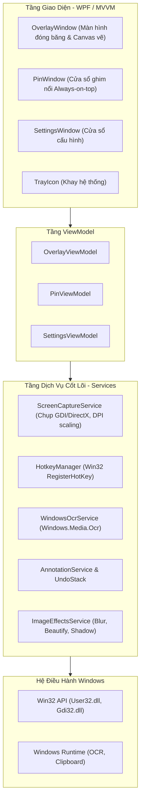

# TÀI LIỆU CÔNG NGHỆ VÀ KIẾN TRÚC HỆ THỐNG (TECH STACK & ARCHITECTURE)

**Dự án:** NeatSnap (Ứng dụng chụp màn hình thông minh trên Windows)  
**Tác giả:** Tu-hoc  
**Target OS:** Windows 10 (version 1809 trở lên) & Windows 11  
**Mục tiêu:** Nhẹ, khởi động tức thì, chụp sạch không rác giao diện, tính năng hiện đại (Pin, OCR, Beautify).

---

## 1. Lựa chọn Công nghệ (Tech Stack)

### 1.1 Nền tảng cốt lõi
* **Ngôn ngữ:** C# 12 / .NET 8 (hoặc .NET 9)
* **Framework:** **WPF (Windows Presentation Foundation)**
  * *Target Framework Moniker:* `net8.0-windows10.0.19041.0` (cho phép gọi trực tiếp các API hiện đại của Windows Runtime như `Windows.Media.Ocr` mà không cần thư viện ngoài).
* **Kiến trúc thiết kế:** **MVVM (Model - View - ViewModel)** kết hợp Clean Service Layer.

### 1.2 Thư viện bên thứ ba (NuGet Packages)
| Gói NuGet | Phiên bản gợi ý | Mục đích sử dụng |
|---|---|---|
| `CommunityToolkit.Mvvm` | 8.x | Triển khai MVVM chuẩn mực, tối ưu hóa code với Source Generators (`[ObservableProperty]`, `[RelayCommand]`). |
| `Wpf.Ui` | 3.x | Thư viện UI mang phong cách Fluent Design của Windows 11 (hỗ trợ Mica/Acrylic material, dark mode, icon set hiện đại). |
| `H.NotifyIcon.Wpf` | 2.x | Tạo icon khay hệ thống (System Tray) bằng XAML, xử lý đóng mở popup và bắt sự kiện click mượt mà. |
| `Microsoft.Extensions.DependencyInjection` | 8.x | Quản lý Dependency Injection (DI) cho các service (Capture, Hotkey, Storage, OCR). |
| `SkiaSharp` *(hoặc `System.Drawing.Common`)* | 2.88.x | Xử lý đồ họa hiệu năng cao: làm mờ (Gaussian Blur), khảm hạt (Pixelate), đổ bóng (Drop shadow), bo góc, render các lớp vẽ chú thích. |

---

## 2. Kiến trúc tổng thể (Architecture Overview)

Hệ thống được chia thành 3 tầng chính:



---

## 3. Cấu trúc thư mục dự án (Project Structure)

```text
NeatSnap/
│
├── App.xaml / App.xaml.cs          # Điểm khởi đầu ứng dụng, cấu hình DI Container & chạy nền
│
├── Core/                           # Tầng xử lý logic nghiệp vụ và tương tác hệ thống
│   ├── Interop/                    # Gọi hàm Win32 API (P/Invoke)
│   │   ├── NativeMethods.cs        # RegisterHotKey, SetForegroundWindow, ShowWindow, BitBlt...
│   │   ├── NativeConstants.cs      # Mã lỗi, hằng số Window Messages (WM_HOTKEY, SW_HIDE...)
│   │   └── NativeStructs.cs        # RECT, POINT, MONITORINFOEX...
│   │
│   ├── Services/                   # Các dịch vụ độc lập
│   │   ├── IScreenCaptureService.cs# Interface chụp màn hình
│   │   ├── ScreenCaptureService.cs # Xử lý chụp sạch, DPI awareness, ghép đa màn hình
│   │   ├── IHotkeyService.cs       # Đăng ký và lắng nghe phím tắt toàn cục
│   │   ├── HotkeyService.cs
│   │   ├── IOcrService.cs          # Quét chữ offline
│   │   ├── WindowsOcrService.cs    # Tận dụng Windows.Media.Ocr
│   │   ├── IImageProcessingService.cs # Render layer vẽ, Blur, Pixelate, Beautify
│   │   ├── ImageProcessingService.cs
│   │   └── AppSettingsService.cs   # Lưu/đọc cấu hình người dùng (JSON)
│   │
│   ├── Models/                     # Dữ liệu
│   │   ├── CaptureRegion.cs        # Tọa độ vùng chọn (X, Y, Width, Height)
│   │   ├── DrawingElement.cs       # Đối tượng vẽ (Pencil, Rect, Arrow, StepNumber...)
│   │   └── AppSettings.cs          # Cấu hình phím tắt, đường dẫn lưu, theme...
│   │
│   └── Helpers/                    # Tiện ích bổ trợ
│       ├── DpiHelper.cs            # Tính toán tỉ lệ scale màn hình (Per-Monitor DPI v2)
│       └── ColorHelper.cs          # Chuyển đổi HEX, RGB, HSV
│
├── UI/                             # Tầng giao diện người dùng (WPF)
│   ├── Views/                      # Cửa sổ hiển thị (XAML)
│   │   ├── OverlayWindow.xaml      # Cửa sổ fullscreen trong suốt để kéo chọn & vẽ
│   │   ├── PinWindow.xaml          # Cửa sổ ghim ảnh Always-on-Top
│   │   └── SettingsWindow.xaml     # Giao diện cài đặt (Wpf.Ui Fluent style)
│   │
│   ├── Controls/                   # Các UserControl tái sử dụng
│   │   ├── SelectionCanvas.xaml    # Canvas kéo vùng chọn & tối viền ngoài
│   │   ├── AnnotationToolbar.xaml  # Thanh công cụ nổi cạnh vùng chọn
│   │   ├── MagnifierBox.xaml       # Kính lúp x4 & bắt mã màu
│   │   └── ColorPickerPopup.xaml   # Bảng chọn màu và kích thước nét vẽ
│   │
│   └── ViewModels/                 # ViewModel điều khiển giao diện
│       ├── OverlayViewModel.cs
│       ├── PinViewModel.cs
│       └── SettingsViewModel.cs
│
└── Assets/                         # Tài nguyên tĩnh
    ├── Icons/                      # Icon app (.ico), icon khay hệ thống, icon công cụ
    └── Styles/                     # XAML Resource Dictionaries (Colors, Brushes, Templates)
```

---

## 4. Giải pháp cho các bài toán kỹ thuật trọng tâm

### 4.1 Giải thuật "Chụp sạch" (Clean Shot Algorithm)
* **Vấn đề:** Khi bấm icon dưới tray, popup menu của Windows tray hoặc menu ngữ cảnh vẫn đang mở và bị chụp dính vào ảnh.
* **Giải pháp kỹ thuật:**
  1. Khi nhận lệnh chụp (qua phím tắt hoặc tray click), gọi `SetForegroundWindow` về cửa sổ desktop (`GetDesktopWindow()`) hoặc gửi tín hiệu để Windows chủ động ẩn popup.
  2. Ẩn toàn bộ cửa sổ của ứng dụng (`Visibility = Collapsed`).
  3. Cho thread nghỉ một khoảng trễ cực ngắn: `await Task.Delay(120)` (đủ để hiệu ứng đóng popup của Windows 11 hoàn tất, nhưng người dùng không cảm nhận thấy độ trễ).
  4. Thực hiện chụp ảnh toàn màn hình bằng `BitBlt` hoặc `Graphics.CopyFromScreen`.
  5. Mở `OverlayWindow` hiển thị bức ảnh vừa chụp lên toàn bộ các màn hình.

### 4.2 Xử lý DPI Scaling & Đa màn hình (Per-Monitor DPI Awareness)
* Bật chế độ `PerMonitorV2` trong file `app.manifest`:
  ```xml
  <application xmlns="urn:schemas-microsoft-com:asm.v3">
    <windowsSettings>
      <dpiAwareness xmlns="http://schemas.microsoft.com/SMI/2016/WindowsSettings">PerMonitorV2</dpiAwareness>
    </windowsSettings>
  </application>
  ```
* Tính toán toạ độ bao phủ toàn bộ màn hình ảo (`SystemParameters.VirtualScreenLeft`, `Top`, `Width`, `Height`) để hỗ trợ người dùng có 2 hoặc 3 màn hình kích thước khác nhau.

### 4.3 Quản lý Layer vẽ chú thích & Hoàn tác (Undo Stack)
* Sử dụng mô hình **Vector Canvas**: Các nét vẽ (Hình chữ nhật, bút vẽ, mũi tên, số thứ tự) không ghi đè trực tiếp làm hỏng bitmap ảnh gốc, mà được lưu thành danh sách các đối tượng `DrawingElement` trong bộ nhớ.
* Cơ chế `Undo`:
  * Lưu vào danh sách `Stack<DrawingElement> _undoStack`.
  * Khi bấm `Ctrl + Z`, chỉ cần `_undoStack.Pop()` và yêu cầu Canvas vẽ lại (Redraw) danh sách còn lại.
* Khi người dùng bấm **Copy** hoặc **Lưu**: Ghép bitmap ảnh gốc và toàn bộ các đối tượng trong canvas lại thành một file PNG duy nhất.

### 4.4 Cửa sổ ghim nổi (Pin to Screen)
* Tạo một WPF Window riêng biệt:
  * `WindowStyle = WindowStyle.None`
  * `AllowsTransparency = True`
  * `Topmost = True` (Luôn nổi trên cùng)
* Bắt sự kiện chuột:
  * Kéo thả: `MouseLeftButtonDown` → gọi `this.DragMove()`.
  * Lăn chuột (`MouseWheel`): Scale biến đổi kích thước ảnh.
  * Phím `Esc` hoặc Double Click: Đóng cửa sổ ghim.

### 4.5 Tích hợp Windows OCR (Hoạt động offline, siêu nhanh)
* Sử dụng namespace chính chủ `Windows.Media.Ocr.OcrEngine`:
  ```csharp
  // Khởi tạo engine OCR theo ngôn ngữ máy (tiếng Việt hoặc tiếng Anh)
  var engine = OcrEngine.TryCreateFromUserProfileLanguages();
  
  // Chuyển bitmap vùng chụp thành SoftwareBitmap
  // Quét chữ:
  var result = await engine.RecognizeAsync(softwareBitmap);
  string extractedText = result.Text;
  
  // Đưa vào Clipboard:
  Clipboard.SetText(extractedText);
  ```

---

## 5. Kế hoạch thiết lập dự án ban đầu (Scaffolding Steps)

Khi bắt đầu code, các bước khởi tạo dự án sẽ gồm:
1. `dotnet new wpf -n NeatSnap -f net8.0-windows10.0.19041.0`
2. Cài đặt các package: `CommunityToolkit.Mvvm`, `Wpf.Ui`, `H.NotifyIcon.Wpf`.
3. Cấu hình file `app.manifest` kích hoạt DPI Awareness PerMonitorV2.
4. Cấu hình `App.xaml` không tạo cửa sổ chính mặc định (`ShutdownMode="OnExplicitShutdown"`) để app chạy nền dưới tray.
