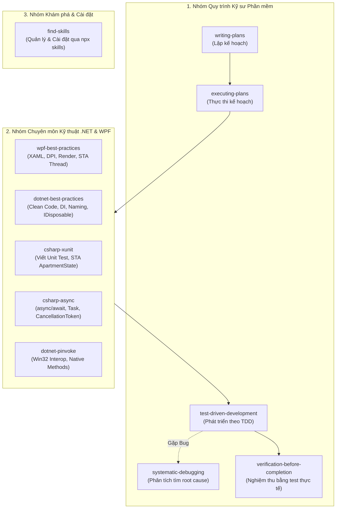

# HƯỚNG DẪN CHI TIẾT VỀ AGENT SKILLS VÀ CÁCH CÀI ĐẶT BẰNG NPX

Tài liệu này tổng hợp toàn bộ các kỹ năng (Agent Skills) đã được kích hoạt và sử dụng trong dự án **NeatShot**, đồng thời hướng dẫn chi tiết cách tìm kiếm, cài đặt và quản lý các skill thông qua công cụ dòng lệnh **`npx skills`** từ hệ sinh thái [skills.sh](https://skills.sh/).

---

## 1. Agent Skill là gì?

**Agent Skill** là một gói tri thức và quy trình chuyên biệt (workflow cheatsheet) được chuẩn hóa để mở rộng khả năng của trợ lý AI (như Antigravity, Claude, Cursor, Windsurf...). 

Một skill cung cấp cho AI:
- Các quy tắc và tiêu chuẩn chuyên ngành (Best Practices).
- Quy trình phát triển phần mềm có kỷ luật (TDD, Systematic Debugging, SDD Planning).
- Đoạn mã mẫu, hướng dẫn phòng tránh lỗi thường gặp (Pitfalls & Antipatterns).
- Định nghĩa rõ ràng khi nào nên tự động kích hoạt để phối hợp với các skill khác.

Trong dự án NeatShot, các skill được đặt tại thư mục:
```text
NeatShot/
└── .agents/
    └── skills/
        ├── csharp-async/
        ├── csharp-xunit/
        ├── dotnet-best-practices/
        ├── dotnet-pinvoke/
        ├── executing-plans/
        ├── find-skills/
        ├── systematic-debugging/
        ├── test-driven-development/
        ├── verification-before-completion/
        ├── wpf-best-practices/
        └── writing-plans/
```

---

## 2. Các Skill đã sử dụng trong dự án NeatShot

Dự án sử dụng **11 skills** được chia thành 3 nhóm rõ rệt, kết hợp chặt chẽ trong suốt quá trình phát triển tính năng:



### Nhóm 1: Quy trình Kỹ sư Phần mềm (Engineering Workflow)

| Tên Skill | Mô tả & Vai trò | Ứng dụng thực tế trong cuộc trò chuyện |
| :--- | :--- | :--- |
| **`writing-plans`** | Lập kế hoạch chi tiết (Implementation Plan) theo cấu trúc SDD, chia nhỏ thành các task độc lập, chỉ rõ file cần sửa và test cần viết. | Được kích hoạt khi bạn yêu cầu bổ sung các tính năng vẽ oval, đường thẳng, highlight, text, eyedropper, và color history. Tạo ra bản kế hoạch 8 tasks tại `docs/superpowers/plans/...`. |
| **`executing-plans`** | Dẫn dắt AI thực thi nghiêm ngặt kế hoạch đã lập từng task một, theo dõi checklist và cập nhật ledger tiến độ. | Được bạn kích hoạt qua lệnh `/executing-plans` cho từng task từ Task 1 đến Task 8. |
| **`test-driven-development`** | Quy trình Red-Green-Refactor: Viết test thất bại trước, chỉ viết mã vừa đủ để test pass, sau đó refactor. | Áp dụng ở toàn bộ các Task 1 - 8: viết test `ColorPickerHelperTests`, `DrawingCanvasTests`, `ColorHistoryTests` trước khi viết code nghiệp vụ. |
| **`systematic-debugging`** | Quy trình sửa lỗi khoa học 4 bước: Tái hiện lỗi -> Tìm Root Cause có bằng chứng -> Viết test chứng minh -> Sửa triệt để, cấm sửa mò. | Được sử dụng khi điều tra nguyên nhân thanh công cụ tự chọn màu đỏ khi mới kéo chọn vùng ảnh, và hiện tượng đóng băng màn hình. |
| **`verification-before-completion`** | Bắt buộc chạy các lệnh kiểm thử thực tế (`dotnet test`) và kiểm tra output PASS trước khi kết luận hoàn thành. | Tự động chạy sau mỗi task, đảm bảo từ 74 test ban đầu tăng lên 104 test đều pass 100%. |

### Nhóm 2: Chuyên môn Kỹ thuật .NET & WPF (Domain Skills)

| Tên Skill | Mô tả & Vai trò | Ứng dụng thực tế trong cuộc trò chuyện |
| :--- | :--- | :--- |
| **`wpf-best-practices`** | Tiêu chuẩn kiến trúc WPF, tối ưu Canvas render, xử lý Per-Monitor DPI scaling, VisualTreeHelper, Dispatcher và STA Thread. | Áp dụng khi tạo kính lúp Loupe badge bám theo con trỏ chuột, tính tọa độ DPI scaling cho `ColorPickerHelper`, tính toán vị trí nổi của Toolbar. |
| **`dotnet-best-practices`** | Kiến trúc mã nguồn .NET, cấu trúc Dependency Injection, xử lý IDisposable, naming convention và Modern C# 12/13. | Thiết kế `ColorHistory` với ObservableCollection, xử lý các Service Interfaces và kiểm tra null an toàn. |
| **`csharp-xunit`** | Tiêu chuẩn viết unit test với xUnit, khởi tạo `Thread.SetApartmentState(ApartmentState.STA)` để test các component UI WPF không bị lỗi thread. | Dùng trong tất cả các file test của `DrawingCanvas`, `AnnotationToolbar`, `OverlayWindow`. |
| **`csharp-async`** | Thực hành viết `async/await` an toàn, quản lý Task không chặn UI Thread, hỗ trợ CancellationToken khi người dùng bấm Esc. | Áp dụng trong `ExecuteCopyAsync` và `ExecuteSaveAsync` của `OverlayWindow`. |
| **`dotnet-pinvoke`** | Gọi native C/C++ Win32 API an toàn bằng P/Invoke và `[LibraryImport]`, quản lý SafeHandle. | Dùng trong tầng Interop để chụp màn hình desktop và đăng ký phím tắt toàn cục. |

### Nhóm 3: Khám phá & Cài đặt (Ecosystem)

| Tên Skill | Mô tả & Vai trò |
| :--- | :--- |
| **`find-skills`** | Trợ giúp tìm kiếm và cài đặt các skill chuyên biệt từ hệ sinh thái mở [skills.sh](https://skills.sh/) thông qua công cụ dòng lệnh `npx skills`. |

---

## 3. Cách Cài đặt Skill bằng NPX (`npx skills`)

Công cụ **Skills CLI (`npx skills`)** là trình quản lý gói (package manager) chính thức của hệ sinh thái open agent skills. Bạn không cần cài đặt trước qua `npm install`, chỉ cần chạy trực tiếp qua `npx`.

### 3.1. Tìm kiếm Skill từ dòng lệnh

Tìm kiếm các skill có sẵn trên kho cộng đồng bằng từ khóa:
```bash
# Cú pháp tổng quát
npx skills find <từ-khóa>

# Ví dụ: Tìm skill về kiểm thử hoặc WPF/.NET
npx skills find wpf
npx skills find csharp
npx skills find testing
npx skills find pr-review
```

Bạn cũng có thể duyệt trực tiếp bảng xếp hạng các skill phổ biến nhất tại: **[https://skills.sh/](https://skills.sh/)**.

---

### 3.2. Cài đặt Skill vào Dự án (Workspace Level)

Để cài đặt một skill vào dự án hiện tại (tạo file trong thư mục `.agents/skills/<tên-skill>/`):

```bash
# Cú pháp
npx skills add <owner/repo@tên-skill>

# Ví dụ: Cài đặt skill từ repository GitHub cụ thể
npx skills add vercel-labs/agent-skills@react-best-practices
npx skills add anthropics/skills@frontend-design
```

Khi chạy lệnh này trong thư mục gốc của dự án, Skills CLI sẽ tải file `SKILL.md` và các tài nguyên liên quan vào thư mục `.agents/skills/`.

---

### 3.3. Cài đặt Skill Toàn cục (Global Level)

Nếu bạn muốn một skill có hiệu lực trên **tất cả mọi dự án** trên máy tính của bạn:

```bash
# Thêm cờ -g (global) và -y (tự động đồng ý xác nhận)
npx skills add <owner/repo@tên-skill> -g -y
```

Skill toàn cục sẽ được lưu tại thư mục cấu hình cá nhân:
- Windows: `%USERPROFILE%\.gemini\config\skills\` (hoặc `%USERPROFILE%\.claude\skills\`)
- macOS/Linux: `~/.gemini/config/skills/` (hoặc `~/.claude/skills/`)

---

### 3.4. Cập nhật tất cả các Skill đã cài đặt

Để nâng cấp tất cả các skill lên phiên bản mới nhất từ kho nguồn:

```bash
npx skills update
```

---

## 4. Bảng Tra cứu Lệnh cài đặt các Skill phổ biến

Dưới đây là một số skill phổ biến từ cộng đồng kỹ sư phần mềm trên [skills.sh](https://skills.sh/) mà bạn có thể cài thêm:

| Nhu cầu phát triển | Lệnh cài đặt đề xuất | Nguồn |
| :--- | :--- | :--- |
| **Frontend & UI Design** | `npx skills add anthropics/skills@frontend-design -y` | Anthropic Official |
| **Code Review & Quality** | `npx skills add vercel-labs/agent-skills@code-review -y` | Vercel Labs |
| **Tối ưu Web Performance** | `npx skills add vercel-labs/agent-skills@web-performance -y` | Vercel Labs |
| **Viết tài liệu Docs & API** | `npx skills add anthropics/skills@api-docs -y` | Anthropic Official |
| **Git Workflow & Changelog** | `npx skills add ComposioHQ/awesome-claude-skills@git-commit -y` | Composio |

---

## 5. Cấu trúc của một Skill và Cách tự tạo Skill mới

Nếu bạn có một quy trình riêng cho dự án hoặc công ty của mình, bạn hoàn toàn có thể tự tạo một skill mới.

### 5.1. Khởi tạo skill bằng lệnh `init`

```bash
npx skills init my-custom-skill
```

Lệnh trên sẽ tạo một thư mục `my-custom-skill/` chứa file khuôn mẫu `SKILL.md`.

### 5.2. Cấu trúc tiêu chuẩn của một file `SKILL.md`

File `SKILL.md` bắt buộc phải có phần đầu (YAML frontmatter) định nghĩa `name` và `description`:

```markdown
---
name: my-custom-skill
description: Hướng dẫn chi tiết cho AI cách thực hiện công việc X theo tiêu chuẩn của công ty Y. Tự động kích hoạt khi người dùng hỏi về X hoặc làm việc với module Z.
---

# Tên Hướng Dẫn Kỹ Năng

## 1. Khi nào nên dùng Skill này
- Mô tả các trường hợp cụ thể người dùng cần đến skill.

## 2. Các nguyên tắc bắt buộc (Rules)
- Quy tắc 1
- Quy tắc 2

## 3. Mã nguồn mẫu (Examples)
```csharp
// Code ví dụ chuẩn mực
```

## 4. Các lỗi cần tránh (Common Mistakes)
- Không làm thế này...
- Nên làm thế kia...
```

### 5.3. Cơ chế AI tự động nhận diện Skill

Khi bạn bắt đầu một phiên làm việc, AI Assistant sẽ tự động quét hai vị trí:
1. **Global Root:** `C:\Users\<Tên-User>\.gemini\config\skills\`
2. **Workspace Root:** Thư mục `.agents/skills/` bên trong dự án đang mở.

Bất kỳ thư mục nào có chứa file `SKILL.md` hợp lệ đều sẽ được lập chỉ mục (index). Khi bạn gửi câu hỏi hoặc dùng slash command (`/writing-plans`, `/executing-plans`), AI sẽ tự động đọc nội dung skill tương ứng để tuân thủ hướng dẫn.

---

## 6. Mẹo phối hợp các Skill hiệu quả khi làm việc với AI

1. **Bắt đầu tính năng lớn luôn dùng `/writing-plans`:** Đừng vội yêu cầu AI viết code ngay. Hãy để AI đọc tài liệu đặc tả và lập ra danh sách các task nhỏ, có kiểm thử rõ ràng.
2. **Thực thi từng bước bằng `/executing-plans`:** Yêu cầu AI làm từng task một (Task 1, Task 2...). Điều này giúp kiểm soát chất lượng, tránh việc AI sửa quá nhiều file một lúc dẫn đến lỗi khó debug.
3. **Kết hợp TDD:** Luôn nhắc AI: *"Áp dụng test-driven-development và wpf-best-practices"* để AI viết test trước và đảm bảo code giao diện không bị giật lag, memory leak.
4. **Nghiệm thu trước khi chốt:** Luôn yêu cầu AI chạy test kiểm tra thực tế bằng lệnh `dotnet test` trước khi commit code.
