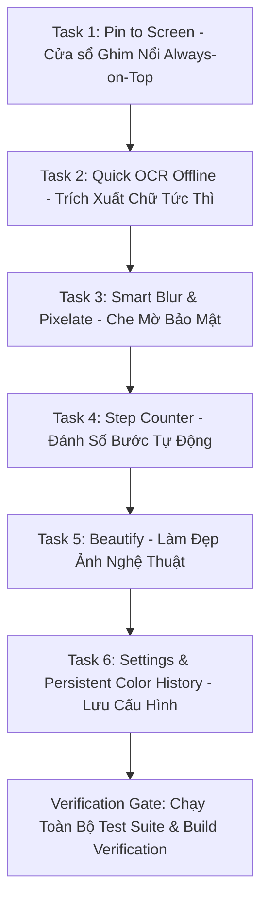

# Phase 2: Killer Features (Tính Năng Đột Phá) Implementation Plan

> **For agentic workers:** REQUIRED SUB-SKILL: Use superpowers:executing-plans to implement this plan task-by-task. Steps use checkbox (`- [ ]`) syntax for tracking.

**Goal:** Triển khai toàn bộ Nhóm tính năng đột phá (Phase 2: Killer Features) của NeatShot theo tài liệu đặc tả [SRS-screenshot-app.md](file:///d:/Tu-hoc/project/NeatShot/docs/SRS-screenshot-app.md) và [TECH-STACK-AND-ARCHITECTURE.md](file:///d:/Tu-hoc/project/NeatShot/docs/TECH-STACK-AND-ARCHITECTURE.md):
1. **Pin to Screen (FR-20):** Cửa sổ nổi Always-on-Top ghim ảnh chụp, hỗ trợ di chuyển tự do, phóng to/thu nhỏ (Zoom) và chỉnh độ mờ (Opacity).
2. **Quick OCR (FR-21):** Nhận diện và trích xuất chữ offline siêu tốc từ vùng ảnh chụp qua Windows OCR API (`Windows.Media.Ocr`), tự động sao chép vào Clipboard.
3. **Smart Blur & Pixelate (FR-22):** Công cụ che mờ và khảm ô vuông bảo mật thông tin nhạy cảm (token, mật khẩu, thông tin cá nhân).
4. **Step Counter (FR-23):** Đánh số bước tự động (①, ②, ③...) phục vụ viết tài liệu kỹ thuật và báo cáo lỗi.
5. **Beautify (FR-24):** Tự động thêm padding nghệ thuật, bo tròn góc ảnh, đổ bóng mềm và nền gradient hiện đại sẵn sàng chia sẻ.
6. **Persistent Settings & Color History (FR-18 & Persistence):** Tự động lưu cấu hình và bảng màu yêu thích vào file JSON trong `%AppData%`, duy trì xuyên suốt các phiên chụp.

**Architecture:** 
- Tiếp tục duy trì chuẩn kiến trúc MVVM, Clean Service Layer và Vector Canvas của NeatShot.
- Tận dụng trực tiếp Windows Runtime projection của `net10.0-windows10.0.19041.0` cho `Windows.Media.Ocr.OcrEngine` và `SoftwareBitmap` (không phụ thuộc thư viện OCR bên ngoài).
- Tách biệt `PinWindow` thành cửa sổ không viền độc lập trong `Presentation/Views`, hỗ trợ nhiều instance chạy song song trên STA thread.
- Xử lý hiệu ứng đồ họa (Blur, Pixelate, Beautify) hiệu năng cao qua thuật toán bitmap buffer và `DrawingRenderer` trong `Common/Helpers`, đồng bộ giữa hiển thị Canvas và xuất ảnh `ExportService`.
- Đảm bảo Per-Monitor DPI awareness (DIPs vs Physical Pixels) trên mọi màn hình scale 100%, 125%, 150%.

**Tech Stack:** C# 12, .NET 10 (`net10.0-windows10.0.19041.0`), WPF, WPF-UI, `Windows.Media.Ocr`, xUnit.

**Spec:** [SRS-screenshot-app.md](file:///d:/Tu-hoc/project/NeatShot/docs/SRS-screenshot-app.md) (Mục 1.4, 3.2, 5, 7), [TECH-STACK-AND-ARCHITECTURE.md](file:///d:/Tu-hoc/project/NeatShot/docs/TECH-STACK-AND-ARCHITECTURE.md) (Mục 1.2, 2, 4.3, 4.4, 4.5).

---

## Global Constraints

- Target OS: Windows 10 (1809 trở lên) và Windows 11.
- Target Framework: `net10.0-windows10.0.19041.0`.
- Tất cả UI updates và thao tác trên Window/Control phải thực hiện trên luồng STA qua `Dispatcher`.
- Tuân thủ Per-Monitor DPI: chuyển đổi chính xác giữa DPI độc lập thiết bị (96 DPI) và physical device pixels khi xử lý ảnh bitmap.
- Không được làm gãy bất kỳ bài test nào trong số 112 tests hiện có. Bộ test mới phải đạt 100% PASS sau mỗi task.
- Giữ vững nguyên tắc Clean Shot: không làm rò rỉ cửa sổ hoặc kẹt overlay.

---

## Review Focus

1. **Hiệu năng và giải phóng tài nguyên của PinWindow:** Nhiều cửa sổ Pin có thể mở đồng thời; phải giải phóng bộ nhớ ảnh và bitmap handle khi người dùng đóng bằng `Esc` hoặc Double Click.
2. **Khả năng tương thích ngôn ngữ OCR:** `Windows.Media.Ocr` phụ thuộc vào gói ngôn ngữ đã cài trên máy người dùng; phải có cơ chế fallback an toàn (TryCreateFromUserProfileLanguages -> Language("en-US") -> thông báo rõ ràng) khi máy thiếu gói OCR.
3. **Hiệu năng xử lý Pixelate/Blur:** Thuật toán Box Blur / Pixelate phải tính toán trực tiếp trên mảng byte pixel `O(N)`, không gây giật lag (frame drop) trên ảnh 4K.
4. **Đồng bộ số thứ tự Step Counter:** Khi người dùng Undo một số bước hoặc xóa nhãn số, bộ đếm bước tiếp theo phải đồng bộ hợp lý mà không tạo số bị nhảy cóc kỳ lạ.
5. **Render Beautify khi xuất ảnh:** Gradient, Padding và Shadow phải kết xuất chính xác từng pixel sang file PNG và Clipboard tương đương với ảnh preview.

---

## Task Decomposition



---

### Task 1: Ghim Ảnh Lên Màn Hình (Pin to Screen - FR-20)

**Mô tả:** Tạo cửa sổ nổi không viền `PinWindow` luôn hiển thị trên cùng (Always-on-Top). Cho phép người dùng kéo di chuyển (`DragMove`), lăn chuột để phóng to/thu nhỏ (Zoom 20% - 500%), phím tắt/cuộn để chỉnh độ mờ (Opacity 20% - 100%), và đóng bằng `Esc` hoặc Double Click. Bổ sung nút Ghim (📌) trên thanh công cụ.

**Files:**
- Create: `src/NeatShot/Presentation/Views/PinWindow.xaml`
- Create: `src/NeatShot/Presentation/Views/PinWindow.xaml.cs`
- Create: `src/NeatShot/Presentation/ViewModels/PinViewModel.cs`
- Modify: `src/NeatShot/Presentation/Controls/AnnotationToolbar.xaml`
- Modify: `src/NeatShot/Presentation/Controls/AnnotationToolbar.xaml.cs`
- Modify: `src/NeatShot/Presentation/Views/OverlayWindow.xaml.cs`
- Modify: `src/NeatShot/App.xaml.cs`
- Create: `tests/NeatShot.Tests/ViewModels/PinViewModelTests.cs`
- Create: `tests/NeatShot.Tests/Views/PinWindowTests.cs`

**Interfaces:**
- Consumes: `BitmapSource`, `IExportService.RenderFinalImage`
- Produces:
  - `PinWindow.ShowPin(BitmapSource image, Point initialPosition)`
  - `PinViewModel.Scale`, `PinViewModel.Opacity`, `PinViewModel.ZoomIn()`, `PinViewModel.ZoomOut()`
  - `AnnotationToolbar.PinRequested` event

- [x] **Step 1: Viết failing test cho `PinViewModel` (Zoom, Opacity, Bounds)**
- [x] **Step 2: Viết failing test cho `AnnotationToolbar.PinRequested` và khởi tạo `PinWindow`**
- [x] **Step 3: Chạy `dotnet test` xác nhận test thất bại (RED)**
- [x] **Step 4: Triển khai `PinViewModel.cs` kế thừa `ViewModelBase`**
- [x] **Step 5: Triển khai `PinWindow.xaml` và `PinWindow.xaml.cs` với kéo thả, MouseWheel Zoom/Opacity**
- [x] **Step 6: Thêm nút `PinButton` (📌) vào `AnnotationToolbar.xaml` và kết nối với `OverlayWindow.xaml.cs`**
- [x] **Step 7: Chạy `dotnet test` xác nhận test chuyển sang màu xanh (GREEN)**
- [x] **Step 8: Commit `feat(pin): implement Pin to Screen floating window with zoom and opacity`**

---

### Task 2: Nhận Diện Chữ Tức Thì Offline (Quick OCR - FR-21)

**Mô tả:** Tích hợp `Windows.Media.Ocr.OcrEngine` để nhận diện chữ offline từ ảnh chụp trong vùng chọn, tự động copy văn bản vào Clipboard và hiển thị thông báo toast/HUD.

**Files:**
- Create: `src/NeatShot/Core/Services/Interfaces/IOcrService.cs`
- Create: `src/NeatShot/Core/Services/Implementations/WindowsOcrService.cs`
- Modify: `src/NeatShot/Presentation/Controls/AnnotationToolbar.xaml`
- Modify: `src/NeatShot/Presentation/Controls/AnnotationToolbar.xaml.cs`
- Modify: `src/NeatShot/Presentation/Views/OverlayWindow.xaml.cs`
- Modify: `src/NeatShot/App.xaml.cs`
- Create: `tests/NeatShot.Tests/Services/OcrServiceTests.cs`

**Interfaces:**
- Consumes: `BitmapSource`, `Windows.Media.Ocr.OcrEngine`
- Produces:
  - `IOcrService.RecognizeTextAsync(BitmapSource image, CancellationToken ct) -> Task<string>`
  - `IOcrService.IsOcrSupported() -> bool`
  - `AnnotationToolbar.OcrRequested` event

- [x] **Step 1: Viết failing test cho `IOcrService` (quét chuỗi text, xử lý null/empty, fallback ngôn ngữ)**
- [x] **Step 2: Chạy `dotnet test` xác nhận test thất bại (RED)**
- [x] **Step 3: Triển khai `IOcrService.cs` và `WindowsOcrService.cs` (chuyển đổi BitmapSource sang SoftwareBitmap và gọi OcrEngine)**
- [x] **Step 4: Đăng ký `IOcrService` trong `App.xaml.cs` (DI Singleton)**
- [x] **Step 5: Thêm nút `OcrButton` (`[OCR]`) vào `AnnotationToolbar.xaml`, liên kết logic quét chữ và copy vào Clipboard trong `OverlayWindow.xaml.cs`**
- [x] **Step 6: Chạy `dotnet test` xác nhận test vượt qua (GREEN)**
- [x] **Step 7: Commit `feat(ocr): implement offline Quick OCR service and toolbar action`**

---

### Task 3: Che Mờ Thông Tin Nhạy Cảm (Smart Blur & Pixelate - FR-22)

**Mô tả:** Bổ sung công cụ khảm điểm ảnh (Pixelate/Mosaic) và làm mờ (Blur) để che mật khẩu, token, thông tin riêng tư. Hỗ trợ thao tác kéo thả hình chữ nhật vùng bảo mật trên `DrawingCanvas` và render chuẩn xác qua `DrawingRenderer`.

**Files:**
- Create: `src/NeatShot/Common/Helpers/ImageEffectHelper.cs`
- Modify: `src/NeatShot/Core/Models/DrawingElement.cs` (`DrawingToolType.Pixelate`, `DrawingToolType.Blur`, `PixelateBlockSize`, `BlurRadius`)
- Modify: `src/NeatShot/Common/Helpers/DrawingRenderer.cs`
- Modify: `src/NeatShot/Presentation/Controls/DrawingCanvas.cs`
- Modify: `src/NeatShot/Presentation/Controls/AnnotationToolbar.xaml`
- Modify: `src/NeatShot/Presentation/Controls/AnnotationToolbar.xaml.cs`
- Modify: `src/NeatShot/Presentation/Views/OverlayWindow.xaml.cs`
- Create: `tests/NeatShot.Tests/Helpers/ImageEffectHelperTests.cs`
- Modify: `tests/NeatShot.Tests/Helpers/DrawingRendererTests.cs`

**Interfaces:**
- Consumes: `BitmapSource`, `Rect`, Block size / Blur radius
- Produces:
  - `ImageEffectHelper.ApplyPixelate(BitmapSource source, Rect region, int blockSize = 10) -> BitmapSource`
  - `ImageEffectHelper.ApplyBoxBlur(BitmapSource source, Rect region, int radius = 8) -> BitmapSource`
  - `DrawingToolType.Pixelate`, `DrawingToolType.Blur`
  - Render sub-bitmap trên DrawingContext

- [x] **Step 1: Viết failing test cho `ImageEffectHelper` (thuật toán Pixelate và Box Blur trên WriteableBitmap/byte array)**
- [x] **Step 2: Viết failing test cho `DrawingRenderer` khi vẽ phần tử `Pixelate`**
- [x] **Step 3: Chạy `dotnet test` xác nhận test thất bại (RED)**
- [x] **Step 4: Triển khai `ImageEffectHelper.cs` với thuật toán xử lý mảng byte pixel tối ưu hiệu năng O(N)**
- [x] **Step 5: Mở rộng `DrawingElement.cs`, `DrawingRenderer.cs` và `DrawingCanvas.cs` hỗ trợ kéo chọn vùng mờ/khảm**
- [x] **Step 6: Bổ sung nút `PixelateButton` (🔲/🧊) trên `AnnotationToolbar.xaml`**
- [x] **Step 7: Chạy `dotnet test` xác nhận test xanh (GREEN)**
- [x] **Step 8: Commit `feat(fx): implement smart pixelate and blur redaction tools`**

---

### Task 4: Đánh Số Bước Tự Động (Step Counter - FR-23)

**Mô tả:** Thêm công cụ nhãn số thứ tự (①, ②, ③...). Mỗi lần click chuột trên ảnh, hệ thống tự động gắn một huy hiệu tròn chứa số tăng dần, có màu viền và số tương phản cao, hỗ trợ Undo/Redo và di chuyển bằng công cụ Select.

**Files:**
- Modify: `src/NeatShot/Core/Models/DrawingElement.cs` (`DrawingToolType.StepCounter`, `StepNumber`)
- Modify: `src/NeatShot/Common/Helpers/DrawingRenderer.cs` (vẽ hình tròn màu nền + text số chính giữa)
- Modify: `src/NeatShot/Common/Helpers/HitTestHelper.cs` (hit-test hình tròn step badge)
- Modify: `src/NeatShot/Presentation/Controls/DrawingCanvas.cs` (quản lý bộ đếm bước, reset/decrement khi Undo)
- Modify: `src/NeatShot/Presentation/Controls/AnnotationToolbar.xaml`
- Modify: `src/NeatShot/Presentation/Controls/AnnotationToolbar.xaml.cs`
- Create: `tests/NeatShot.Tests/Controls/StepCounterTests.cs`

**Interfaces:**
- Consumes: `DrawingToolType.StepCounter`, `Color`, `Point`
- Produces:
  - `DrawingElement.StepNumber`
  - `DrawingCanvas.NextStepNumber` (tự động tăng sau mỗi click, đồng bộ với UndoStack)
  - `DrawingRenderer.DrawStepBadge(DrawingContext dc, Point center, int number, Color color, double radius = 14)`

- [x] **Step 1: Viết failing test cho bộ đếm bước (tăng số thứ tự, Undo giảm số, vẽ nhãn số đúng tọa độ)**
- [x] **Step 2: Chạy `dotnet test` xác nhận test thất bại (RED)**
- [x] **Step 3: Bổ sung `StepNumber` vào `DrawingElement.cs` và cập nhật `HitTestHelper.cs`**
- [x] **Step 4: Cập nhật `DrawingRenderer.cs` để render huy hiệu tròn sắc nét kèm số nổi bật**
- [x] **Step 5: Cập nhật `DrawingCanvas.cs` xử lý click tạo StepCounter và tự động tính `NextStepNumber`**
- [x] **Step 6: Thêm nút `StepCounterButton` (①) trên `AnnotationToolbar.xaml` và phím tắt `N`**
- [x] **Step 7: Chạy `dotnet test` xác nhận test xanh (GREEN)**
- [x] **Step 8: Commit `feat(annotations): add automatic incremental step counter badge tool`**

---

### Task 5: Làm Đẹp Ảnh Tự Động (Beautify - FR-24)

**Mô tả:** Tự động tạo ảnh chụp nghệ thuật sẵn sàng chia sẻ: thêm khoảng đệm (Padding 32px), bo tròn 4 góc (CornerRadius 12px), đổ bóng mềm đa lớp (Soft Drop Shadow) và nền màu gradient hiện đại (Preset: Sunset, Ocean, Purple, Dark Slate).

**Files:**
- Create: `src/NeatShot/Core/Services/Interfaces/IBeautifyService.cs`
- Create: `src/NeatShot/Core/Services/Implementations/BeautifyService.cs`
- Create: `src/NeatShot/Core/Models/BeautifyOptions.cs` (Padding, CornerRadius, GradientPresets)
- Modify: `src/NeatShot/Core/Services/Interfaces/IExportService.cs`
- Modify: `src/NeatShot/Core/Services/Implementations/ExportService.cs`
- Modify: `src/NeatShot/Presentation/Controls/AnnotationToolbar.xaml`
- Modify: `src/NeatShot/Presentation/Controls/AnnotationToolbar.xaml.cs`
- Modify: `src/NeatShot/Presentation/Views/OverlayWindow.xaml.cs`
- Modify: `src/NeatShot/App.xaml.cs`
- Create: `tests/NeatShot.Tests/Services/BeautifyServiceTests.cs`

**Interfaces:**
- Consumes: `BitmapSource`, `BeautifyOptions`
- Produces:
  - `IBeautifyService.ApplyBeautify(BitmapSource source, BeautifyOptions options) -> BitmapSource`
  - Preset gradients: Sunset, Ocean, Violet, Mesh Dark
  - `AnnotationToolbar.BeautifyToggled` / `BeautifyRequested`

- [ ] **Step 1: Viết failing test cho `BeautifyService` (kiểm tra kích thước xuất tăng thêm padding, format ARGB, áp dụng shadow và bo góc)**
- [ ] **Step 2: Chạy `dotnet test` xác nhận test thất bại (RED)**
- [ ] **Step 3: Triển khai `BeautifyOptions.cs` và `BeautifyService.cs` qua DrawingVisual kết xuất RenderTargetBitmap**
- [ ] **Step 4: Tích hợp `IBeautifyService` vào `ExportService.cs` và đăng ký trong `App.xaml.cs`**
- [ ] **Step 5: Thêm nút `BeautifyButton` (✨) trên `AnnotationToolbar.xaml` và hộp tùy chọn preset nhanh**
- [ ] **Step 6: Chạy `dotnet test` xác nhận test xanh (GREEN)**
- [ ] **Step 7: Commit `feat(beautify): add screenshot beautifier with gradient padding and drop shadow`**

---

### Task 6: Lưu Trữ Cấu Hình & Bảng Màu Yêu Thích (Settings & Persistence - FR-18)

**Mô tả:** Lưu trữ vĩnh viễn cấu hình người dùng, phím tắt, thư mục lưu mặc định và danh sách màu trong Color History vào file `%AppData%\NeatShot\settings.json`. Khi mở app hoặc chụp ảnh, tự động nạp lại lịch sử màu gần nhất.

**Files:**
- Create: `src/NeatShot/Core/Models/AppSettings.cs`
- Create: `src/NeatShot/Core/Services/Interfaces/ISettingsService.cs`
- Create: `src/NeatShot/Core/Services/Implementations/SettingsService.cs`
- Modify: `src/NeatShot/Presentation/Controls/AnnotationToolbar.xaml.cs` (nạp/lưu ColorHistory qua SettingsService)
- Modify: `src/NeatShot/Presentation/Views/OverlayWindow.xaml.cs`
- Modify: `src/NeatShot/App.xaml.cs` (khởi tạo và inject ISettingsService)
- Create: `tests/NeatShot.Tests/Services/SettingsServiceTests.cs`

**Interfaces:**
- Consumes: `System.Text.Json`, `%AppData%` path
- Produces:
  - `ISettingsService.LoadSettings() -> AppSettings`
  - `ISettingsService.SaveSettings(AppSettings settings) -> Task`
  - Tự động duy trì danh sách màu Color History giữa các lần chụp

- [ ] **Step 1: Viết failing test cho `SettingsService` (ghi/đọc file JSON, xử lý lỗi file hỏng, giá trị mặc định)**
- [ ] **Step 2: Chạy `dotnet test` xác nhận test thất bại (RED)**
- [ ] **Step 3: Triển khai `AppSettings.cs`, `ISettingsService.cs` và `SettingsService.cs`**
- [ ] **Step 4: Đăng ký `ISettingsService` Singleton trong `App.xaml.cs`**
- [ ] **Step 5: Kết nối `AnnotationToolbar.History` với `SettingsService` để lưu/nạp màu tự động**
- [ ] **Step 6: Chạy `dotnet test` xác nhận test xanh (GREEN)**
- [ ] **Step 7: Commit `feat(settings): add JSON settings persistence for app options and color history`**

---

## Verification Gate (Xác Nhận Toàn Bộ Dự Án)

Sau khi hoàn tất cả 6 Task:
1. Chạy biên dịch toàn bộ solution:
   ```powershell
   dotnet build src/NeatShot/NeatShot.csproj
   ```
2. Chạy toàn bộ test suite (dự kiến > 135 tests):
   ```powershell
   dotnet test tests/NeatShot.Tests/NeatShot.Tests.csproj
   ```
3. Xác nhận không có test thất bại (Failed: 0) và toàn bộ tính năng mới hoạt động mượt mà.
